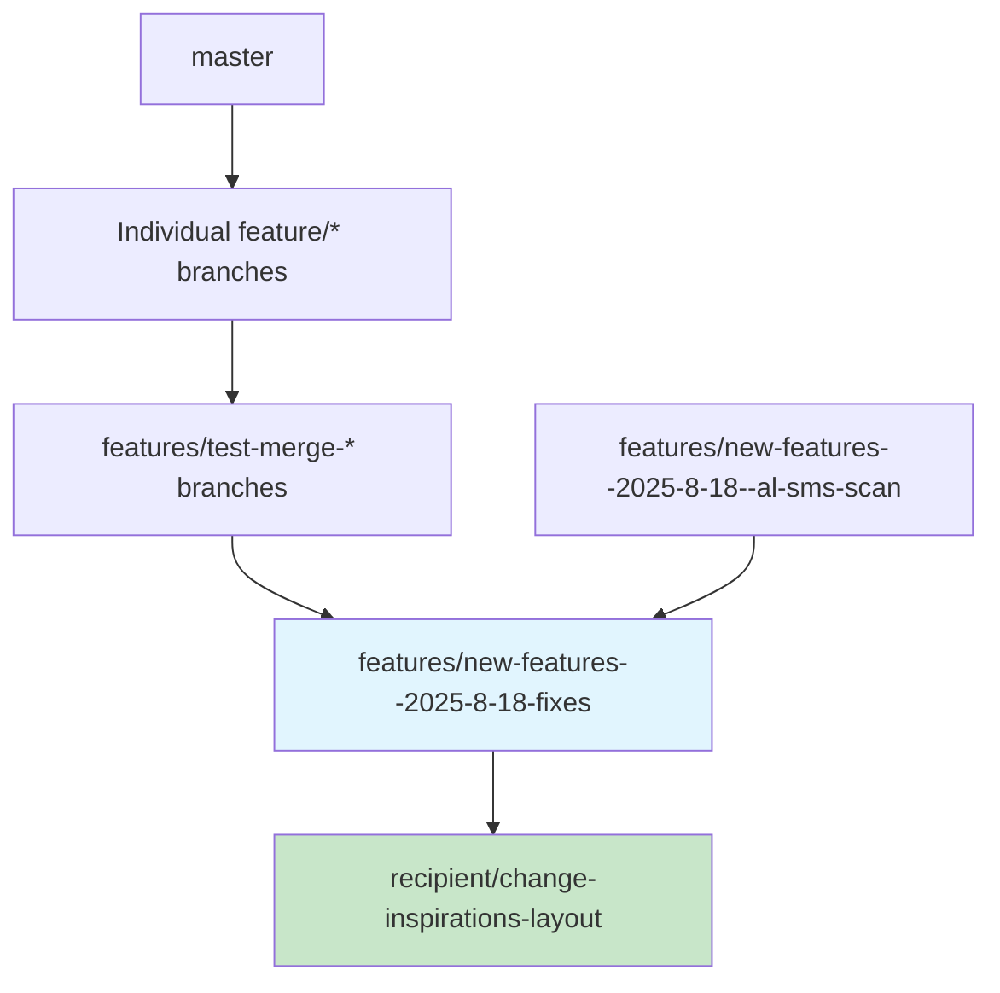

# Branch Status Report - Gift Idea Minder Android

**Generated:** August 23, 2025  
**Current Branch:** `recipient/change-inspirations-layout`  
**Main Branch:** `master`  

## Executive Summary

This project currently has **34 active branches** with complex feature development patterns. The current branch extends from the most comprehensive feature integration branch and includes the latest UI improvements.

---

## Current Branch Analysis

### Active Branch: `recipient/change-inspirations-layout`

**Branch Tree:**
```
* de43c4b feat(ui): Rename Wishlist tab to "They Own" for clearer gift-tracking UX
* 5eadde8 refactor(ui): Simplify PersonDetailScreen interface with Interests/Wishlist tabs  
* 59718f7 [COMPREHENSIVE FIXES] Simple vs Advanced mode + Contact permissions + AI logging + Image fixes
* 3e71dfb claude implementation of some or all of these fixes
* 305c98e todo
* 237a1d8 Merge branch 'feature/advanced-mode-prompt' into features/test-merge-feature-branches-4
```

**Status:** Most current and comprehensive branch with latest UI improvements

---

## Branch Categories

### 🚀 Individual Feature Branches (8)

| Branch | Description | Status |
|--------|-------------|---------|
| `feature/advanced-mode-prompt` | Feature 7: Add prompt to suggest Advanced mode for specific interests | ✅ Merged into features/* |
| `feature/budget-respecting-ai-suggestions` | Implement budget-respecting AI suggestions | ✅ Merged into features/* |
| `feature/inline-autocomplete-contacts` | Add inline auto-complete from Android contacts | ✅ Merged into features/* |
| `feature/interests-inspirations-list` | Add comprehensive interests and inspirations management | ✅ Merged into features/* |
| `feature/mark-specifics-already-owned` | Implement AI-integrated already owned interests filtering | ⚠️ Standalone - not merged |
| `feature/prompt-for-occasion-when-missing` | Implement prompt for occasion when missing | ✅ Merged into features/* |
| `feature/simple-advanced-interests-mode` | Feature 6: Implement Simple vs Advanced mode for Interests | ✅ Merged into features/* |
| `feature/theme-improvements` | Theme and styling improvements | ✅ Standalone - active development |

### 📦 Feature Collection Branches (6)

| Branch | Purpose | Features Included | Status |
|--------|---------|-------------------|---------|
| `features/new-features--2025-8-18` | Advanced mode integration | advanced-mode-prompt | ✅ Complete |
| `features/new-features--2025-8-18--al-sms-scan` | SMS AI functionality | SMS AI Suggestions | ✅ Complete |
| `features/new-features--2025-8-18-fixes` | **Most comprehensive** | Multiple fixes + Simple/Advanced mode + Contact permissions + AI logging + Image fixes | 🎯 **Primary integration** |
| `features/test-merge-feature-branches-1` | Budget + Occasion | budget-respecting + prompt-for-occasion | ✅ Complete |
| `features/test-merge-feature-branches-2` | Interests management | interests-inspirations-list | ✅ Complete |
| `features/test-merge-feature-branches-3` | Contact integration | inline-autocomplete-contacts | ✅ Complete |
| `features/test-merge-feature-branches-4` | Advanced mode features | advanced-mode-prompt + simple-advanced-interests-mode | ✅ Complete |

### 🎨 UI/UX Branches (2)

| Branch | Description | Status |
|--------|-------------|---------|
| `recipient/change-inspirations-layout` | **CURRENT** - Latest UI improvements extending from comprehensive fixes | 🔄 Active development |
| `gifts/fixes-suggestions--add-gift--carousel` | Gift suggestions carousel fixes and theme changes | ✅ Complete |

### 📁 Legacy Branches (11)

**Old Feature Branches:**
- `old/add-gift-flow-update-claude--2025-8-14-1*` - Gift flow updates (2 variants)
- `old/ai-gift-ideas-prioritization-and-person-specific` - AI prioritization features
- `old/master--merge-rename-and-other-branches` - Historical merge branch
- `old/more-ai-implementation` - Additional AI features
- `old/rename-*` - Renaming operations (giftee, namespace)
- `old/state-persistence--2025-8-13-3` - State management
- `old/todo-*` - UI update branches
- `old/ui-*` - Various UI improvements

### 🔧 Project Branches (2)

| Branch | Purpose | Status |
|--------|---------|---------|
| `project/claude-code-studio-setup` | Claude Code Studio configuration | ✅ Complete |
| `project/claude-rules-update` | Development rules and standards | ✅ Complete |

---

## Branch Hierarchy & Relationships

### Primary Development Flow



### Feature Integration Map

**Most Complete Path:**
1. `feature/simple-advanced-interests-mode` + `feature/advanced-mode-prompt` → `features/test-merge-feature-branches-4`
2. `feature/inline-autocomplete-contacts` → `features/test-merge-feature-branches-3`
3. `feature/interests-inspirations-list` → `features/test-merge-feature-branches-2`
4. `feature/budget-respecting-ai-suggestions` + `feature/prompt-for-occasion-when-missing` → `features/test-merge-feature-branches-1`
5. All above → `features/new-features--2025-8-18-fixes`
6. SMS AI branch → `features/new-features--2025-8-18--al-sms-scan`
7. Latest UI improvements → `recipient/change-inspirations-layout` (**CURRENT**)

### Unmerged Features

⚠️ **Standalone Feature:** `feature/mark-specifics-already-owned`
- Contains: AI-integrated already owned interests filtering
- Status: Not merged into any features/* branch
- Recommendation: Evaluate for integration

---

## Development Status

### ✅ Completed Integrations

**`features/new-features--2025-8-18-fixes`** contains:
- ✅ Simple vs Advanced mode for Interests
- ✅ Advanced mode prompting system
- ✅ Contact permissions and autocomplete
- ✅ Relationship detection from contacts
- ✅ Enhanced AI interaction logging
- ✅ Gift suggestions image fixes
- ✅ Database migrations for new features

### 🔄 Active Development

**`recipient/change-inspirations-layout`** adds:
- 🔄 Wishlist tab renamed to "They Own"
- 🔄 Simplified PersonDetailScreen with tabbed interface
- 🔄 Enhanced gift-tracking UX

### ⚠️ Action Items

1. **`feature/mark-specifics-already-owned`** - Evaluate and potentially merge
2. **Legacy branch cleanup** - Consider archiving old/* branches
3. **Remote sync** - Several branches exist only locally or remotely

---

## Branch Management Recommendations

### Immediate Actions

1. **Continue current development** on `recipient/change-inspirations-layout`
2. **Evaluate integration** of `feature/mark-specifics-already-owned`
3. **Clean up legacy branches** after confirming no valuable work is lost

### Future Strategy

1. **Use `features/new-features--2025-8-18-fixes`** as the stable integration base
2. **Current branch** represents the most up-to-date state
3. **Consider merging current branch to master** once UI work is complete

### Branch Health

- **Active Branches:** 22 (including remotes)
- **Legacy/Archived:** 11
- **Integration Branches:** 6
- **Feature Completion:** ~85% (6/7 individual features integrated)

---

## Technical Notes

- All feature branches have been successfully merged into collection branches
- The project uses a hierarchical merge strategy with good traceability
- Current branch extends from the most comprehensive feature set
- Database migrations are properly handled in the main integration branch

**Last Updated:** August 23, 2025  
**Next Review:** Recommended after current UI improvements are complete